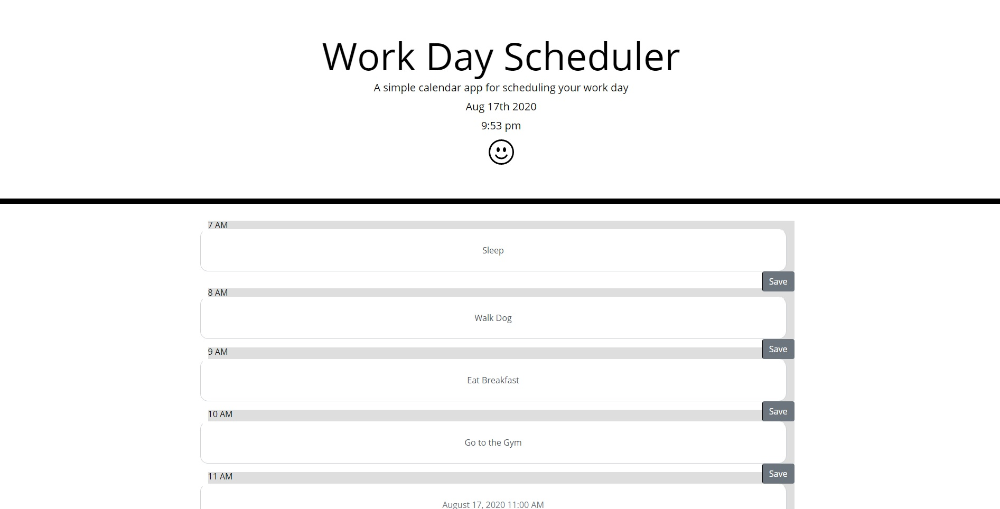

Created a daily planner that allows user to type in their agenda based on the hour from 7am to 7pm. Giving a two hour buffer from the typical 9am-5pm workday incase someone has to schedule some sort of event before or after work. 

Timeblock colors change depending on time of day and if its before, after, or same time as the upcoming time block.

Text is saved via the submit function or by using a save button and fetches the information through the local storage of the user to decrease the chances of items being lost on daily planner from not being properly saved.

Happy face at the top of the page because it's the best way to start your day. Outside of coffee.

